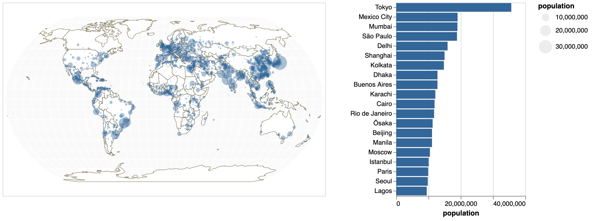
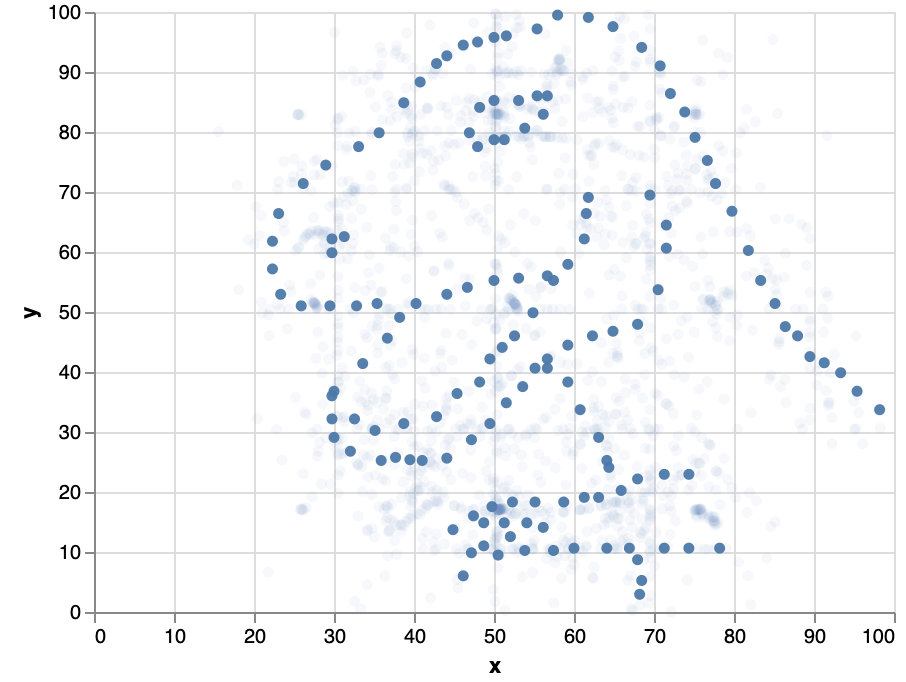
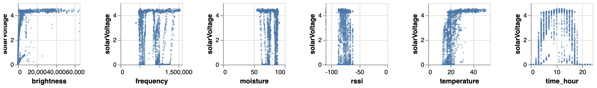
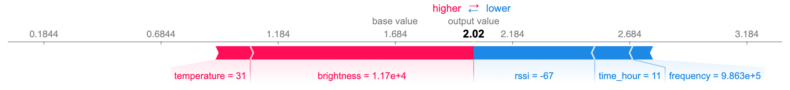
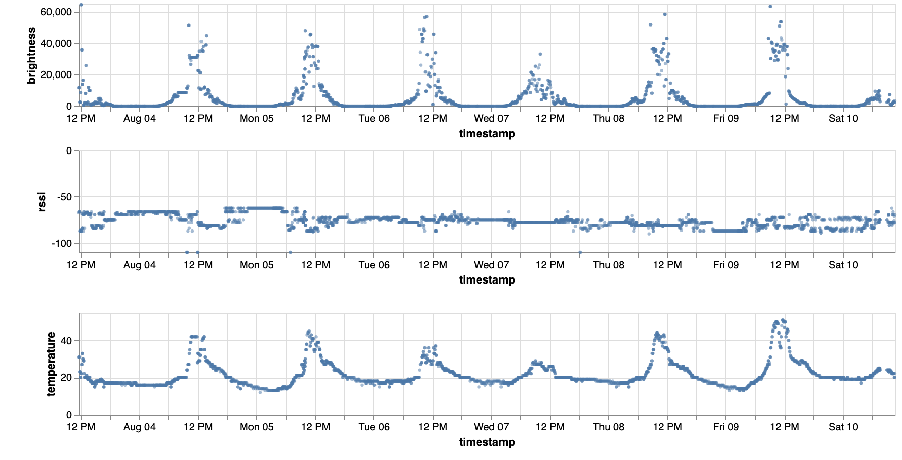
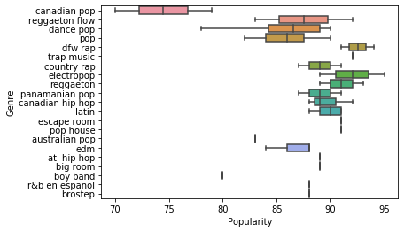
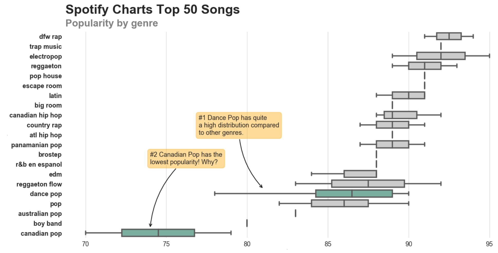
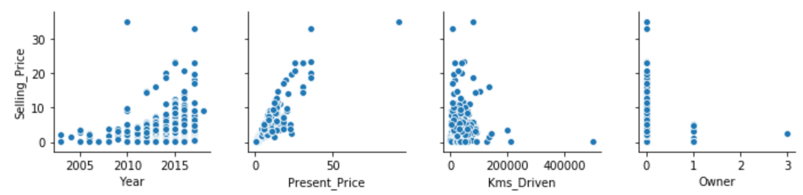
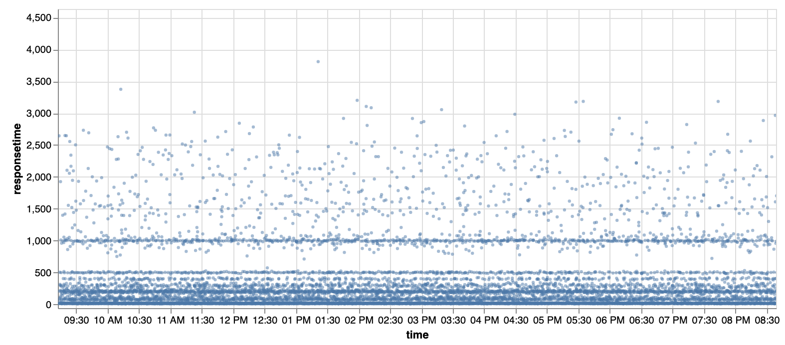
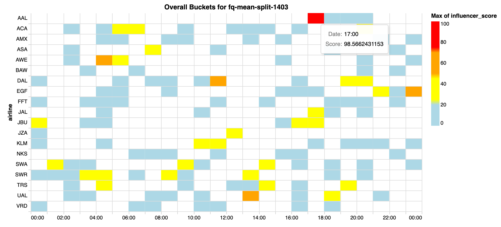

# python-viz

A very subjective collection of Jupyter notebooks to explore data visualization techniques using Python. Documents the outcome of my Space Time project around learning (a bit of) Python, Pandas, Seaborn, Altair and last but not least Eland.

The aim of this endavour is to be able to work closer with the data team and better understand their work. Understanding the python/notebook ecosystem gives us an opportunity in the UI team to directly pick up the work the data team does and prototype visualizations and UI based off it. Esp. using seaborn we can come up very quickly with visualizations based off the data frame analytics data we have in Elasticsearch. Doing this quick prototyping could act as a first stage to evaluate possible UIs we want to have in the Kibana ML plugin.

Another thing I wanted to evaluate is if it's possible to come up with a workflow where a data scientist would create and design visualizations in Python notebooks and then deploy them in Kibana. I didn't get close to a stage where this would be automated but at least I made some promising findings. The Altair visualization library can be used to create VEGA based visualization in notebooks. Altair can be used to export VEGA specs and those can then be used in Kibana using its VEGA plugin. Fetching the data needs manual adaption, but this way it's possible to deploy visualizations looking exactly the same from Python notebooks to Kibana dashboards.

A note on the notebooks: Not all of them render completely on Github, for example the Altair examples require being run in a notebook to render correctly.

## altair_geo

[altair_geo/altair_geo.ipynb](altair_geo/altair_geo.ipynb)

- Demonstrates synced views using [Altair](https://altair-viz.github.io/).)
- Data Source [World Cities Database](https://simplemaps.com/data/world-cities) by [Simple Maps](https://simplemaps.com/) is licensed under [CC BY 4.0](https://creativecommons.org/licenses/by/4.0/).

## datasaurus

[datasaurus/datasaurus.ipynb](datasaurus/datasaurus.ipynb)

- Basic visualizations based on the Datasaurus dataset. Includes different techniques to customize [Seaborn](https://seaborn.pydata.org/) scatterplots. Also demonstrates how to create interface elements to control visualizations with [Altair](https://altair-viz.github.io/).
- Based on [Same Stats, Different Graphs: Generating Datasets with Varied Appearance and Identical Statistics through Simulated Annealing](https://www.autodeskresearch.com/publications/samestats) (Paper)
- Data Source: [Dataset & Images](https://www.autodeskresearch.com/sites/default/files/SameStatsDataAndImages.zip) (ZIP)

## MIYO IoT Sensor Data

- Data based on the MIYO IoT Weather & Irrigation sensor. The notebooks demonstrate data manipulation of sparse source data to make it suitable for e.g. regression analysis.
- The [miyo.ipynb](miyo/miyo.ipynb) notebook uses [Seaborn](https://seaborn.pydata.org/) for scatterplot matrices and [SHAP](https://github.com/slundberg/shap) to visualize feature influence.
- The [miyo_altair.ipynb](miyo/miyo_altair.ipynb) notebook uses [Altair](https://altair-viz.github.io/) to replicate the scatterplots and additionally demonstrates how to visualize time series sensor data as small multiples.

## seaborn_annotations

[seaborn_annotations/seaborn_annotations.ipynb](seaborn_annotations/seaborn_annotations.ipynb)

### Before (seaborn default)

### After (revamped styling & annotations)

- Demonstrates how to redesign a standard seaborn boxplot into a more compelling version that draws the attention towards certain data points using highlighting and annotations. Based on that shows how to wrap a custom visualization in a helper function and create a reusable module out of it.
- Data Source: [Spotify Charts Top 50 2018](https://www.kaggle.com/nadintamer/top-spotify-tracks-of-2018/metadata), License "Data files © Original Authors".

## shap_cars

[shap_cars/shap_cars.ipynb](shap_cars/shap_cars.ipynb) 

- [shap_cars.ipynb](shap_cars/shap_cars.ipynb) demonstrates how to tweak a scatterplot matrix to only show the value distributions relevant for regression analysis, with one row for the target attributes and a chart for each attribute used for the analysis. Note the dataset itself could be transformed to get more interesting results, this was just used to document a very basic workflow to visualize source data with [Seaborn](https://seaborn.pydata.org/), run regression analyis on it and visualize the results using the [SHAP](https://github.com/slundberg/shap) library.
- Dataset: [Vehicle dataset from Cardekho](https://www.kaggle.com/nehalbirla/vehicle-dataset-from-cardekho), License unknown.

## eland

[eland/eland.ipynb](eland/eland.ipynb)

[eland.ipynb](eland/eland.ipynb) demonstrates basic usage of [eland](https://github.com/elastic/eland) to fetch data from Elasticsearch into a Pandas data frame and render it with Altair.

## anomaly_detection

[anomaly_detection/anomaly_detection.ipynb](anomaly_detection/anomaly_detection.ipynb)

[anomaly_detection.ipynb](anomaly_detection/anomaly_detection.ipynb) replicates the Elasticsearch Machine Learning plugin's swimlanes using Altair in Python.
